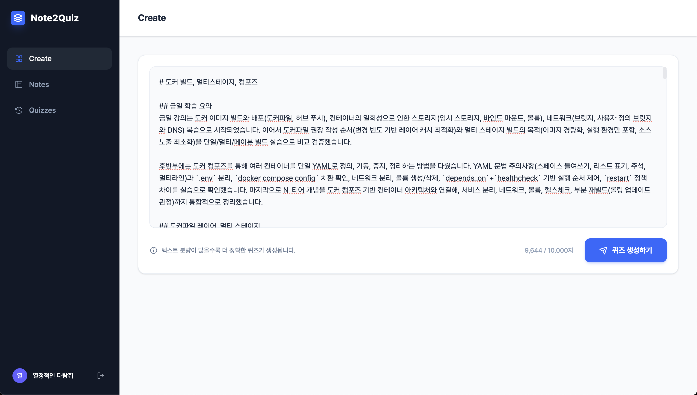
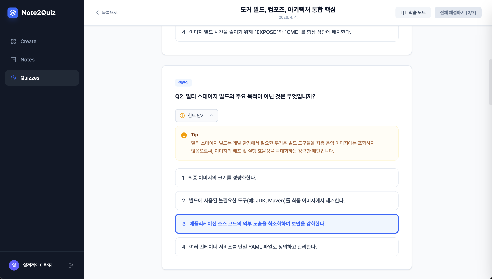
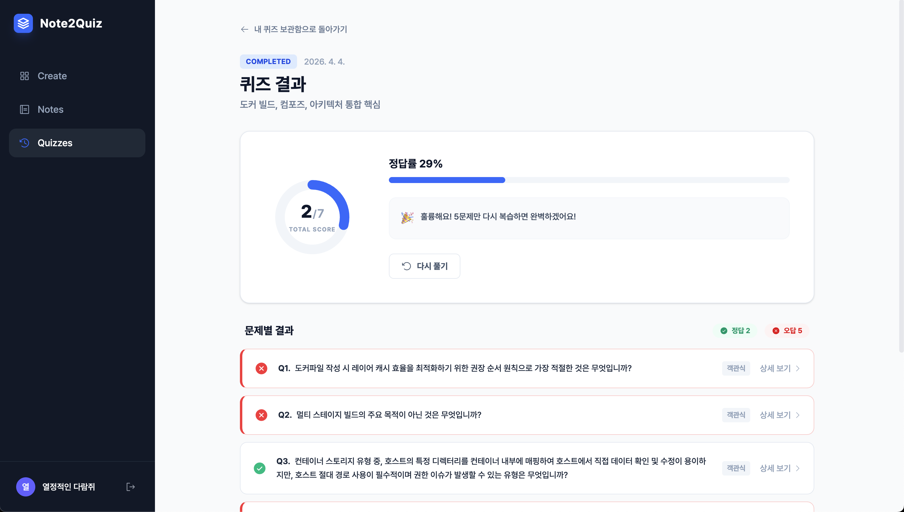
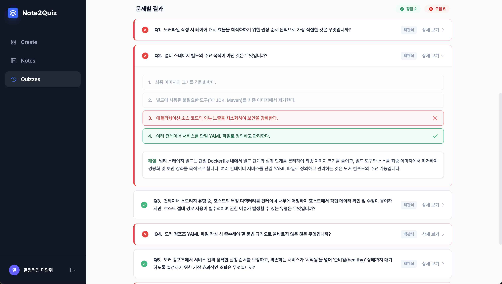

# Note2Quiz

학습 노트를 붙여넣으면 AI가 퀴즈를 자동으로 생성해주는 서비스

---

## 서비스 소개

Note2Quiz는 수업 노트나 학습 자료를 텍스트로 붙여넣으면 Google Gemini AI가 내용을 분석해 객관식 퀴즈를 자동으로 생성해주는 웹 서비스입니다. 생성된 퀴즈에는 힌트(Tip)와 해설이 함께 제공되어 단순 암기를 넘어 개념 이해를 도웁니다. 퀴즈를 직접 풀고 나면 문제별 정오답과 정답률을 한눈에 확인할 수 있어, 노트 작성부터 복습까지 하나의 흐름으로 이어지는 학습 경험을 제공합니다.

---

## 주요 화면

| 퀴즈 생성                                         | 퀴즈 풀기                                        |
| ------------------------------------------------- | ------------------------------------------------ |
|  |  |

| 채점 결과                                         | 문제 상세                                         |
| ------------------------------------------------- | ------------------------------------------------- |
|  |  |

---

## 기술 스택

| 영역     | 기술                                         |
| -------- | -------------------------------------------- |
| Frontend | React, Vite, Tailwind CSS, React Router      |
| Backend  | Spring Boot, Spring AI, Spring Security, JPA |
| Database | MySQL                                        |
| AI       | Google Gemini 2.5 Flash                      |
| Infra    | Docker, Docker Compose, Nginx                |

---

## 레포 구조

```
.
├── apps/
│   ├── backend/      # Spring Boot API 서버
│   └── frontend/     # React 웹 클라이언트 (Nginx로 서빙)
└── docs/
    └── screenshots/  # 서비스 주요 화면 스크린샷
```

---

## 시작하기 (Docker Compose)

### 선행 조건

- [Docker](https://docs.docker.com/get-docker/) 및 [Docker Compose](https://docs.docker.com/compose/install/) 설치 필요

### 환경변수 설정

루트 디렉토리의 `.env.example`을 복사해 `.env` 파일을 생성하고 값을 채워주세요.

```bash
cp .env.example .env
```

| 변수명                | 설명                            |
| --------------------- | ------------------------------- |
| `MYSQL_ROOT_PASSWORD` | MySQL root 계정 비밀번호        |
| `MYSQL_DATABASE`      | 생성할 데이터베이스 이름        |
| `MYSQL_USER`          | 애플리케이션용 DB 사용자명      |
| `MYSQL_PASSWORD`      | 애플리케이션용 DB 비밀번호      |
| `GEMINI_API_KEY`      | Google Gemini API 키            |
| `JWT_SECRET`          | JWT 서명 비밀키 (32바이트 이상) |

> 각 앱의 상세 환경변수 설명은 [Backend README](apps/backend/README.md) / [Frontend README](apps/frontend/README.md)를 참고하세요.

### 실행

```bash
docker compose up --build
```

| 서비스     | 접속 URL              |
| ---------- | --------------------- |
| 프론트엔드 | http://localhost      |
| 백엔드 API | http://localhost:8080 |

### 종료

```bash
docker compose down
```

데이터베이스 볼륨(`mysql-data`)까지 함께 삭제하려면 `-v` 옵션을 추가하세요.

```bash
docker compose down -v
```

---

## 개발 환경 로컬 실행

각 앱을 독립적으로 실행하는 방법은 하위 README를 참고하세요.

- [Backend README](apps/backend/README.md)
- [Frontend README](apps/frontend/README.md)

---

## 개발 기간 / 팀

**개발 기간**: 2025.03.31 ~ 2025.04.03

**팀원**

| 이름   | 담당 파트       |
| ------ | --------------- |
| 고윤성 | 노트 영역       |
| 곽지현 | 노트 CRUD       |
| 이동제 | 인증            |
| 이윤범 | 퀴즈 영역       |
| 전지훈 | 퀴즈 생성/조회  |
| 정지찬 | 인증 & 레이아웃 |
