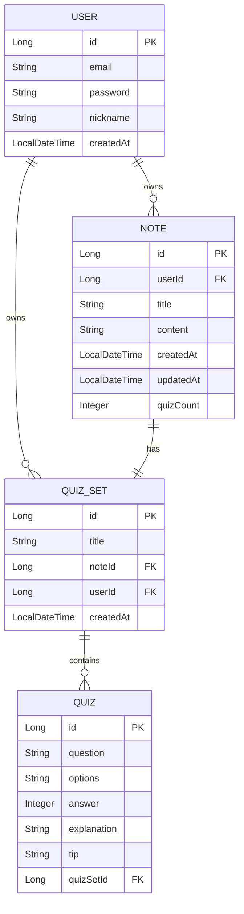

# Note2Quiz Backend

노트 내용을 기반으로 AI가 퀴즈를 자동 생성하는 서비스의 Spring Boot 백엔드입니다.

---

## 기술 스택

| 항목                     | 버전 / 값        |
| ------------------------ | ---------------- |
| Java                     | 17               |
| Spring Boot              | 3.5.13           |
| Spring AI (Google GenAI) | 1.1.3            |
| AI 모델                  | Gemini 2.5 Flash |
| Spring Data JPA          | Spring Boot 관리 |
| Spring Security          | Spring Boot 관리 |
| JJWT                     | 0.11.5           |
| MySQL Connector/J        | Spring Boot 관리 |
| Lombok                   | Spring Boot 관리 |
| 빌드 도구                | Maven (mvnw)     |
| 서버 포트                | 8080             |

---

## 프로젝트 구조

```
src/main/java/com/note2quiz/backend/
├── BackendApplication.java          # 애플리케이션 진입점
├── config/                          # 보안·인증 설정
│   ├── JwtAuthenticationFilter.java # 요청마다 JWT 쿠키를 검증하는 필터
│   ├── JwtTokenProvider.java        # JWT 생성·검증·쿠키 빌더
│   └── SecurityConfig.java          # Spring Security FilterChain, CORS 설정
├── controller/                      # HTTP 요청 처리 (REST 엔드포인트)
│   ├── AuthController.java          # 회원가입·로그인·로그아웃·내 정보
│   ├── NoteController.java          # 노트 목록·상세·삭제
│   └── QuizSetController.java       # 퀴즈 세트 생성·목록·상세
├── dto/                             # 요청/응답 데이터 전달 객체
│   ├── LoginRequest.java
│   ├── LoginResponse.java
│   ├── NoteResponse.java
│   ├── QuizCreateRequest.java
│   ├── QuizCreateResponse.java
│   ├── QuizDetailResponse.java
│   ├── QuizItemResponse.java
│   ├── QuizSummaryResponse.java
│   └── SignupRequest.java
├── entity/                          # JPA 엔티티 (DB 테이블 매핑)
│   ├── Note.java
│   ├── Quiz.java
│   ├── QuizSet.java
│   └── User.java
├── handler/                         # 전역 예외 처리
│   └── GlobalExceptionHandler.java  # IllegalArgumentException, RuntimeException 핸들링
├── repository/                      # Spring Data JPA 리포지토리
│   ├── NoteRepository.java
│   ├── QuizRepository.java
│   ├── QuizSetRepository.java
│   └── UserRepository.java
└── service/                         # 비즈니스 로직
    ├── AuthService.java             # 회원가입·로그인 처리
    ├── NoteService.java             # 노트 조회·삭제 처리
    ├── QuizGeneratorService.java    # AI 퀴즈 생성 (Gemini 호출)
    └── QuizSetService.java          # 퀴즈 세트 생성·조회 처리
```

---

## ERD



> `options` 컬럼은 JSON 타입으로, 객관식 보기 배열을 저장합니다.
> `answer`는 정답 보기의 인덱스(0-based)입니다.
> NOTE ↔ QUIZ_SET 은 1:1 관계입니다. 퀴즈 생성 요청 시 Note와 QuizSet이 하나의 트랜잭션에서 동시에 생성되며, 기존 Note에 QuizSet을 추가하는 API는 존재하지 않습니다.

---

## API 명세

인증이 필요한 엔드포인트는 로그인 시 발급된 `accessToken` HttpOnly 쿠키를 자동으로 전송합니다.

### Auth

| Method | Endpoint           | Description                | Auth 필요 |
| ------ | ------------------ | -------------------------- | --------- |
| POST   | `/api/auth/signup` | 회원가입                   | N         |
| POST   | `/api/auth/login`  | 로그인 (쿠키 발급)         | N         |
| POST   | `/api/auth/logout` | 로그아웃 (쿠키 삭제)       | N         |
| GET    | `/api/auth/me`     | 현재 로그인 유저 정보 조회 | Y         |

---

#### POST `/api/auth/signup`

**Request Body**

```json
{
  "email": "user@example.com",
  "password": "password123",
  "nickname": "홍길동"
}
```

> - `password`: 최소 8자 이상

**Response** `200 OK`

```
회원가입이 완료되었습니다.
```

---

#### POST `/api/auth/login`

**Request Body**

```json
{
  "email": "user@example.com",
  "password": "password123"
}
```

**Response** `200 OK`

`Set-Cookie: accessToken=<JWT>; HttpOnly; Path=/; Max-Age=604800; SameSite=Lax`

```json
{
  "nickname": "홍길동"
}
```

---

#### POST `/api/auth/logout`

**Request Body** 없음

**Response** `200 OK`

`Set-Cookie: accessToken=; HttpOnly; Path=/; Max-Age=0`

```
로그아웃 되었습니다.
```

---

#### GET `/api/auth/me`

**Response** `200 OK`

```json
{
  "nickname": "홍길동"
}
```

---

### Notes

| Method | Endpoint              | Description       | Auth 필요 |
| ------ | --------------------- | ----------------- | --------- |
| GET    | `/api/notes`          | 내 노트 목록 조회 | Y         |
| GET    | `/api/notes/{noteId}` | 노트 상세 조회    | Y         |
| DELETE | `/api/notes/{noteId}` | 노트 삭제         | Y         |

---

#### GET `/api/notes`

**Response** `200 OK`

```json
[
  {
    "id": 1,
    "quizSetId": 1,
    "title": "운영체제 1강",
    "createdAt": "2024-01-01T10:00:00",
    "quizCount": 5,
    "wordCount": 320,
    "preview": "운영체제란 컴퓨터 하드웨어와 소프트웨어..."
  }
]
```

> `content` 필드는 목록 조회 시 반환되지 않습니다 (`@JsonInclude(NON_NULL)`).

---

#### GET `/api/notes/{noteId}`

**Response** `200 OK`

```json
{
  "id": 1,
  "quizSetId": 1,
  "title": "운영체제 1강",
  "content": "운영체제란 컴퓨터 하드웨어와 소프트웨어 사이의 인터페이스입니다...",
  "createdAt": "2024-01-01T10:00:00",
  "quizCount": 5,
  "wordCount": 320
}
```

---

#### DELETE `/api/notes/{noteId}`

**Response** `204 No Content`

---

### Quiz Sets

| Method | Endpoint                     | Description                       | Auth 필요 |
| ------ | ---------------------------- | --------------------------------- | --------- |
| POST   | `/api/quiz-sets`             | 노트 내용으로 퀴즈 세트 생성 (AI) | Y         |
| GET    | `/api/quiz-sets`             | 내 퀴즈 세트 목록 조회            | Y         |
| GET    | `/api/quiz-sets/{quizSetId}` | 퀴즈 세트 상세 조회               | Y         |

---

#### POST `/api/quiz-sets`

**Request Body**

```json
{
  "content": "운영체제란 컴퓨터 하드웨어와 소프트웨어 사이의 인터페이스입니다..."
}
```

**Response** `200 OK`

```json
{
  "quizSetId": 1,
  "noteId": 1,
  "title": "운영체제 1강",
  "questionCount": 5,
  "createdAt": "2024-01-01T10:00:00"
}
```

---

#### GET `/api/quiz-sets`

**Response** `200 OK`

```json
[
  {
    "quizSetId": 1,
    "title": "운영체제 1강",
    "createdAt": "2024-01-01T10:00:00",
    "questionCount": 5
  }
]
```

---

#### GET `/api/quiz-sets/{quizSetId}`

**Response** `200 OK`

```json
{
  "id": 1,
  "title": "운영체제 1강",
  "createdAt": "2024-01-01T10:00:00",
  "noteContent": "운영체제란 컴퓨터 하드웨어와 소프트웨어...",
  "quizzes": [
    {
      "id": 1,
      "question": "운영체제의 주요 역할은 무엇인가?",
      "options": [
        "프로세스 관리",
        "메모리 관리",
        "파일 시스템 관리",
        "위 모두"
      ],
      "answer": 3,
      "explanation": "운영체제는 프로세스, 메모리, 파일 시스템을 모두 관리합니다.",
      "tip": "운영체제의 4대 기능을 기억하세요."
    }
  ]
}
```

---

### 에러 응답 형식

```json
{
  "success": false,
  "message": "에러 메시지"
}
```

| 상태 코드 | 원인                                                          |
| --------- | ------------------------------------------------------------- |
| 400       | `IllegalArgumentException` (잘못된 요청, 유효성 검사 실패 등) |
| 500       | `RuntimeException` (서버 내부 오류)                           |

---

## 환경변수 설정

`application-local.yml` (또는 운영 환경의 `.env`) 에서 아래 항목을 설정합니다.

| 변수명                                            | 설명                            | 예시값                                                                                                                              |
| ------------------------------------------------- | ------------------------------- | ----------------------------------------------------------------------------------------------------------------------------------- |
| `JWT_SECRET`                                      | JWT 서명 비밀키 (32바이트 이상) | `my-secret-key-must-be-at-least-32-bytes`                                                                                           |
| `SPRING_DATASOURCE_URL`                           | MySQL JDBC URL                  | `jdbc:mysql://localhost:3306/note2quiz?useSSL=false&allowPublicKeyRetrieval=true&serverTimezone=Asia/Seoul&characterEncoding=UTF-8` |
| `SPRING_DATASOURCE_USERNAME`                      | DB 사용자명                     | `scott`                                                                                                                             |
| `SPRING_DATASOURCE_PASSWORD`                      | DB 비밀번호                     | `tiger`                                                                                                                             |
| `SPRING_DATASOURCE_DRIVER_CLASS_NAME`             | JDBC 드라이버 클래스            | `com.mysql.cj.jdbc.Driver`                                                                                                          |
| `GEMINI_API_KEY`                                  | Google Gemini API 키            | `AIzaSy...`                                                                                                                         |
| `SPRING_AI_GOOGLE_GENAI_CHAT_OPTIONS_MODEL`       | 사용할 Gemini 모델              | `gemini-2.5-flash`                                                                                                                  |
| `SPRING_AI_GOOGLE_GENAI_CHAT_OPTIONS_TEMPERATURE` | 생성 온도 (0.0 ~ 1.0)           | `0.7`                                                                                                                               |

### `.env.example`

> 로컬 개발 시 `application-local.example.yml` 을 복사하여 `application-local.yml` 로 사용합니다.

```yaml
# application-local.yml

jwt:
  secret: ${JWT_SECRET}

spring:
  datasource:
    url: ${SPRING_DATASOURCE_URL}
    username: ${SPRING_DATASOURCE_USERNAME}
    password: ${SPRING_DATASOURCE_PASSWORD}
    driver-class-name: ${SPRING_DATASOURCE_DRIVER_CLASS_NAME}

  ai:
    google:
      genai:
        api-key: ${GEMINI_API_KEY}
        chat:
          options:
            model: ${SPRING_AI_GOOGLE_GENAI_CHAT_OPTIONS_MODEL}
            temperature: ${SPRING_AI_GOOGLE_GENAI_CHAT_OPTIONS_TEMPERATURE}
```

---

## 로컬 단독 실행 방법

### 선행 조건

MySQL이 실행 중이어야 합니다. DB와 사용자를 미리 생성해 두세요.

```sql
CREATE DATABASE note2quiz CHARACTER SET utf8mb4 COLLATE utf8mb4_unicode_ci;
CREATE USER 'scott'@'localhost' IDENTIFIED BY 'tiger';
GRANT ALL PRIVILEGES ON note2quiz.* TO 'scott'@'localhost';
FLUSH PRIVILEGES;
```

### 설정 파일 준비

```bash
cp apps/backend/src/main/resources/application-local.example.yml \
   apps/backend/src/main/resources/application-local.yml
# application-local.yml 을 열어 실제 값으로 수정
```

### 빌드 및 실행

```bash
cd apps/backend

# 테스트 제외 빌드 후 실행
./mvnw spring-boot:run

# 또는 JAR 빌드 후 실행
./mvnw clean package -DskipTests
java -jar target/backend-0.0.1-SNAPSHOT.jar
```

서버가 정상 기동되면 `http://localhost:8080` 에서 API를 사용할 수 있습니다.

> `spring.jpa.hibernate.ddl-auto: update` 설정으로 애플리케이션 시작 시 테이블이 자동으로 생성·업데이트됩니다.
